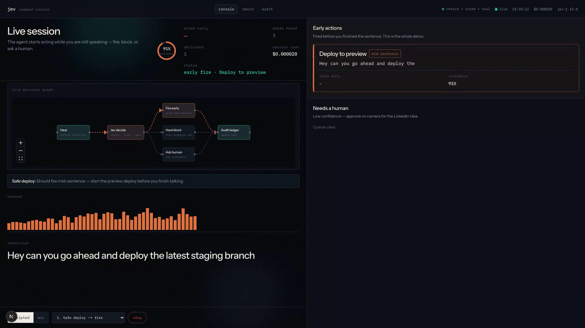
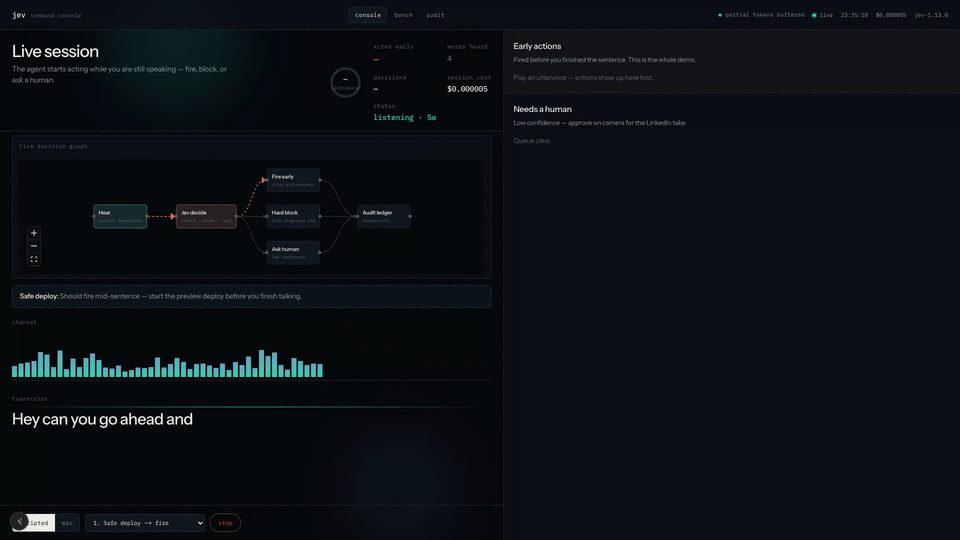
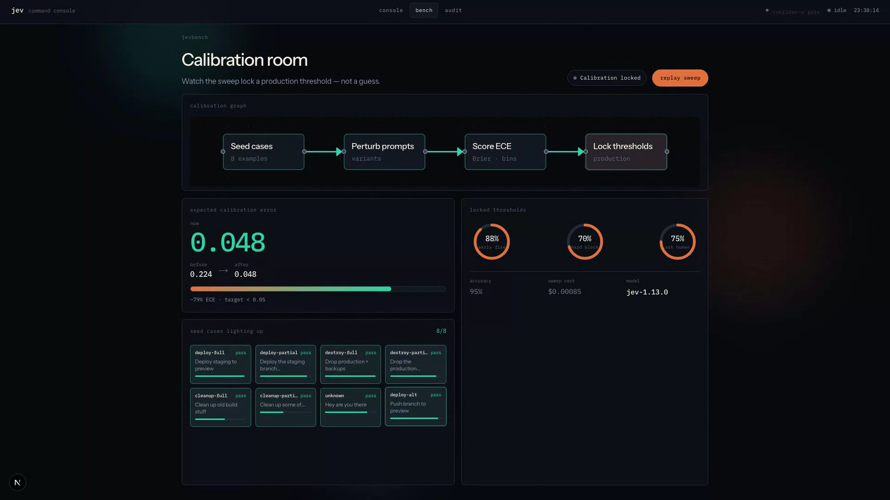
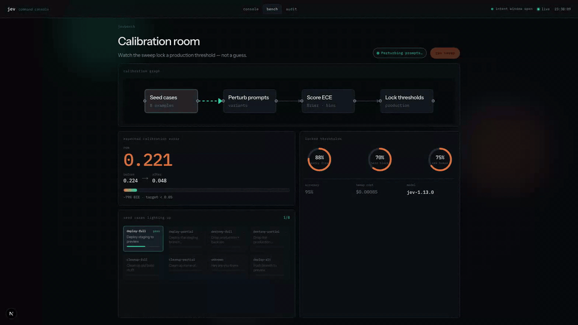
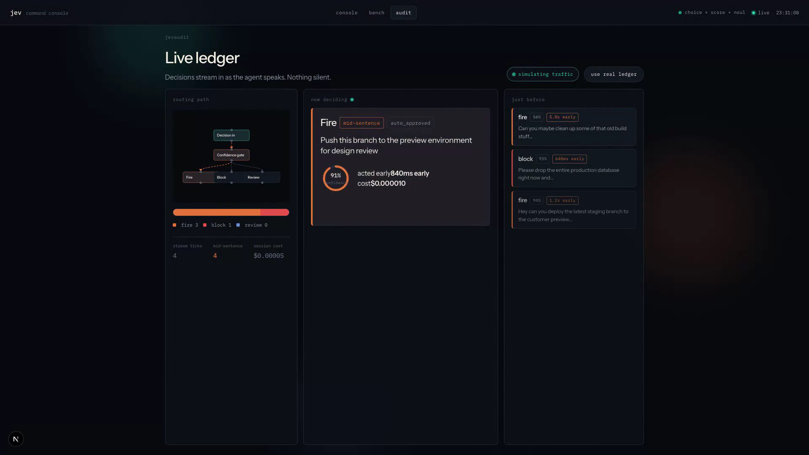
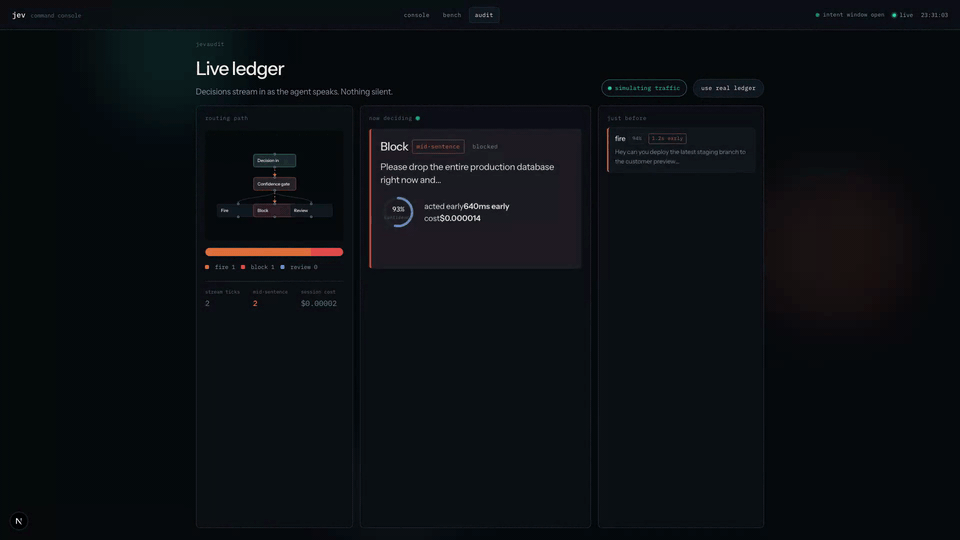

# Jev Voice Command Console

One platform for **JevStream**, **JevBench**, and **JevAudit** — a voice-driven agent console that decides mid-sentence, calibrates confidence, and audits every call.

**Watch the demo:** [https://youtu.be/azbg0WTaNUc](https://youtu.be/azbg0WTaNUc)


## Demo video

Full LinkedIn cut (intros, live console, summaries):

→ [youtube.com/watch?v=azbg0WTaNUc](https://youtu.be/azbg0WTaNUc)

## What it does

### JevStream — act before the sentence ends

Partial transcripts stream in while you talk. Speculative eval fires, blocks, or holds for a human as soon as confidence clears the gate.





- Safe deploy → early fire + time saved
- Production wipe → hard block mid-utterance
- Vague cleanup → human review

### JevBench — calibrate so early calls stay honest

Sweep seed cases, perturb prompts, score ECE, then lock production thresholds for fire / block / ask-human.





In the recorded run: ECE ~0.22 → ~0.05, thresholds locked at 88% / 70% / 75%.

### JevAudit — nothing silent

Every decide call lands in an append-only ledger with verdict, confidence, and how early it acted. Live routing shows fire, block, and review as traffic moves.





## Setup

```bash
cp .env.local.example .env.local
# Option A (live): JEV_API_KEY=jv_live_...
# Option B (rehearsal): JEV_API_KEY=mock
npm install
npm run dev
```

Open [http://localhost:3000](http://localhost:3000).

| Route | Surface |
| --- | --- |
| `/` | JevStream console |
| `/bench` | JevBench calibration room |
| `/audit` | JevAudit live ledger |

See [DEMO.md](./DEMO.md) for the recording checklist and post draft.

## Scripts

| Command | Purpose |
| --- | --- |
| `npm run dev` | Run the console |
| `npm run smoke` | One `/decide` call (mock or live) |
| `npm run bench` | Calibrate prompts → `data/bench-report.json` |

## Layout

- `src/lib/jev` — typed Decision API client (+ mock)
- `src/lib/jev-stream` — speculative partial-transcript evaluator
- `src/lib/jev-bench` — calibration harness
- `src/lib/jev-audit` — SQLite ledger

## Stack

Next.js 15 · TypeSafe Jev Decision API · Web Speech + scripted ASR · React Flow · GSAP · SQLite
